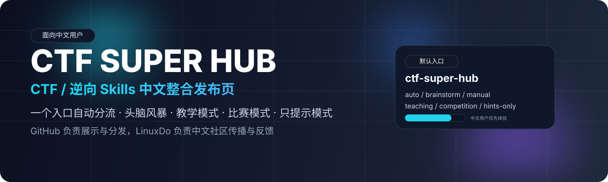

<div align="center">

<p>
  
</p>

# CTF Super Hub / CTF Skills 中文整合包

**给中文用户的 CTF / 逆向统一入口**  
不会选 skill，不会判断题型，也不知道第一步做什么？先用一个入口把路分对，再决定怎么做。

<p>
  <a href="./START-HERE.md">快速开始</a> ·
  <a href="./SKILL-INDEX.md">技能索引</a> ·
  <a href="./docs/USAGE.md">使用说明</a> ·
  <a href="./docs/LINUXDO.md">LinuxDo 社区</a>
</p>

<p>
  
  
  
  
</p>

</div>

---

## 目录导航

- [这是什么](#这是什么)
- [你为什么会需要它](#你为什么会需要它)
- [核心入口](#核心入口)
- [它怎么工作](#它怎么工作)
- [快速开始](#快速开始)
- [安装](#安装)
- [支持哪些环境](#支持哪些环境)
- [仓库结构](#仓库结构)
- [文档导航](#文档导航)
- [校验](#校验)
- [加入社区 · 共建生态](#-加入社区--共建生态)

---

## 这是什么

大多数 CTF skill 包的问题，不是内容不够，而是 **用户根本不知道先用哪个**。

这个仓库解决的是“第一步怎么开始”的问题。

它把一组 CTF / 逆向相关 skill 整理成一个真正能直接使用的中文入口：

- **模式 1：自动分流**
- **模式 2：先头脑风暴，再分流**

用户不用先理解一堆 skill，也不用先学会分类。先从入口进去，系统再帮你决定后面应该走哪条路。

---

## 你为什么会需要它

如果你有过下面这些体验，这个仓库就是给你准备的：

- 看见一堆 skill 名字，但不知道先用哪个
- 拿到一道题，连它是 Web、Crypto、Reverse 还是 Pwn 都分不清
- 明明工具很多，但不知道第一步该敲什么命令
- 想给中文用户整理一套真正能开始做题的入口，而不是再堆一份目录

一句话说：

> 这个仓库不是让你“看懂技能体系”，而是让你**更快开始做题**。

---

## 核心入口

### `ctf-super-hub`（默认推荐）

如果你只记住一个名字，记住它就够了。

它负责：
- 自动判断更像哪一类题
- 在看不懂题面时先做最小化头脑风暴
- 在 `teaching / competition / hints-only` 三种输出方式之间切换
- 在需要时把 Web / 接口 / 漏洞验证动作增强到 `strix-*`
- 题做完后接到 `ctf-writeup`

### `ctf-beginner-hub`

更适合新手和第一次接触这套仓库的人。

它保留和主入口一样的两种模式，但表达更像“带学”，更少术语，更少压迫感。

---

## 它怎么工作

### 模式 1：自动分流

适合：
- 你已经有题面、附件、URL、IP、端口、源码、二进制
- 你只想快点开始

做法：
1. 先判断题目更像哪一类
2. 再决定是走 `ctf-*` 还是增强到 `strix-*`
3. 只给你下一步最该做的 1~3 步

### 模式 2：先头脑风暴，再分流

适合：
- 你看不懂题面
- 你不知道题目到底让你干什么
- 你需要先把目标、材料、卡点讲清楚

做法：
1. 先澄清题目和现状
2. 再决定走哪一类 skill
3. 再给出后续最小化动作

### Strix 在这里是什么角色

Strix 不是另一套主系统。

在这套仓库里，它只是 **增强层**：
- 主结构仍然是 CTF 双模式
- 只有当题目进入 Web / 接口 / 漏洞验证阶段时，才增强到 `strix-*`

也就是说：
- `ctf-super-hub` / `ctf-beginner-hub` 决定主流程
- `strix-*` 只在需要时接管具体 Web 安全测试动作

---

## 快速开始

不要先研究完整结构。最好的理解方式是：**拿一道题直接试。**

### 用法 1：默认推荐（适合 80% 的情况）

```text
请使用 ctf-super-hub 帮我处理这道题。
如果你能判断题型，就自动分流到最合适的 ctf-* skill。
如果信息还不够，就先带我做最小化头脑风暴。
默认用 teaching 风格输出。

题目信息：
[粘贴题面/附件/URL/IP:PORT/源码结构/已做尝试]
```

### 用法 2：比赛模式

```text
请使用 ctf-super-hub 的 auto + competition 模式。
先判断最像哪类题，再只告诉我接下来最该做的 1~3 步。
```

### 用法 3：只想要提示

```text
请使用 ctf-super-hub 的 auto + hints-only 模式。
不要直接把解法全展开，只告诉我下一步该查什么、为什么。
```

### 用法 4：先头脑风暴

```text
请使用 ctf-super-hub 的 brainstorm + teaching 模式。
我现在看不懂这题是什么类型。
先帮我梳理目标、线索、缺失信息，再决定自动路由还是手动路由。
```

---

## 安装

### 默认安装到 Codex 技能目录

```bash
./install-to-codex.sh
```

### 安装到自定义目录

```bash
./install-to-codex.sh /path/to/skills-dir
```

---

## 支持哪些环境

当前仓库主要按 **Codex 风格技能目录** 组织，并且已经能直接安装到：

- Codex / 类 Codex 文件系统代理环境

如果你后续要扩展到：
- Claude Code
- Gemini CLI
- OpenCode

建议把它们的技能目录适配明确写成单独安装脚本或单独文档，而不是在首页里先口头承诺。当前仓库先把主入口和使用体验做对，再扩展安装面。

---

## 仓库结构

```text
.
├── README.md
├── START-HERE.md
├── SKILL-INDEX.md
├── install-to-codex.sh
├── scripts/
│   ├── install_ctf_tools.sh
│   └── validate_skills.py
├── docs/
│   ├── USAGE.md
│   ├── PUBLISHING.md
│   ├── LOCALIZATION.md
│   └── LINUXDO.md
├── .github/
│   ├── ISSUE_TEMPLATE/
│   ├── pull_request_template.md
│   └── workflows/
├── ctf-super-hub/
├── ctf-beginner-hub/
├── solve-challenge/
├── brainstorming/
├── ctf-*/
└── strix-*/
```

---

## 文档导航

- [`START-HERE.md`](./START-HERE.md)：最快上手
- [`SKILL-INDEX.md`](./SKILL-INDEX.md)：技能索引
- [`docs/USAGE.md`](./docs/USAGE.md)：使用说明
- [`docs/LINUXDO.md`](./docs/LINUXDO.md)：LinuxDo 发帖与中文社区建议
- [`docs/PUBLISHING.md`](./docs/PUBLISHING.md)：GitHub 发布前检查清单
- [`docs/LOCALIZATION.md`](./docs/LOCALIZATION.md)：汉化策略与约定

---

## 校验

运行：

```bash
python3 scripts/validate_skills.py
```

它会检查：
- 关键仓库文件是否存在
- 主要 skill 是否有 frontmatter
- 主入口和关键参考文件是否完整

同时仓库也带了 GitHub Actions：
- `.github/workflows/validate.yml`

---

### 🤝 加入社区 · 共建生态

如果你认同这件事，欢迎一起把它做成中文用户真正会用的 CTF / 逆向技能入口。

你可以这样参与：

- 在 **GitHub** 提 issue / PR：补文档、补规则、补用例、补 skill
- 在 **LinuxDo** 反馈体验：说清楚哪一步最卡、哪类题最难上手、哪里最该优化
- 把你的真实使用场景发出来：优先优化最常见、最刚需的部分

<p align="center">
  <a href="https://github.com/asdfgh1445/ctf-super-hub">
    
  </a>
  &nbsp;
  <a href="https://linux.do">
    
  </a>
</p>

<p align="center">
  <sub>LinuxDo 发布帖：待补充</sub>
</p>

<p align="center">
  <i>这个项目真正解决的，不是“skill 不够多”，而是“中文用户的第一步总是最难开始”。</i>
</p>
